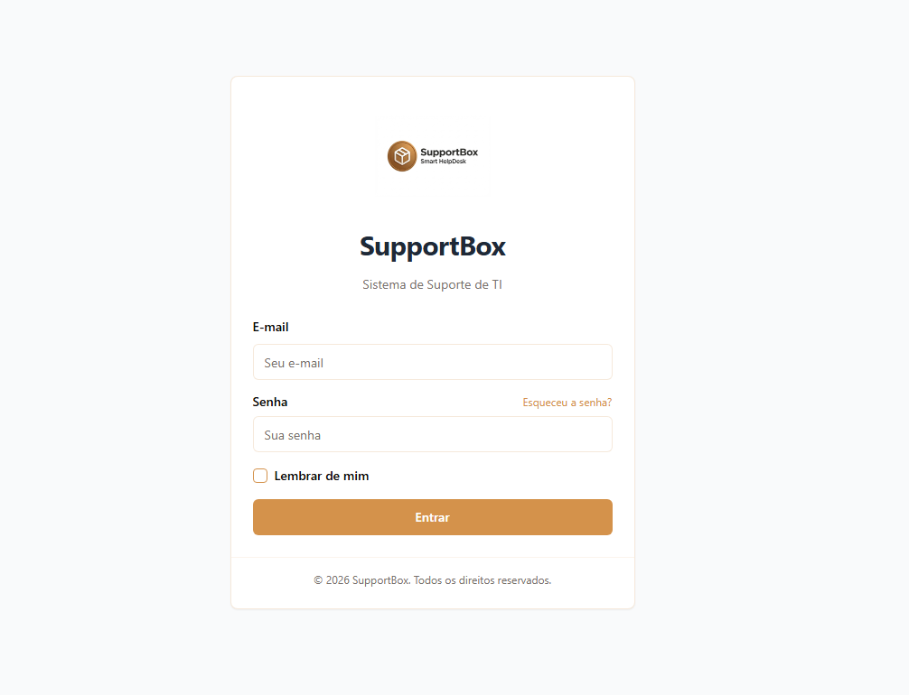
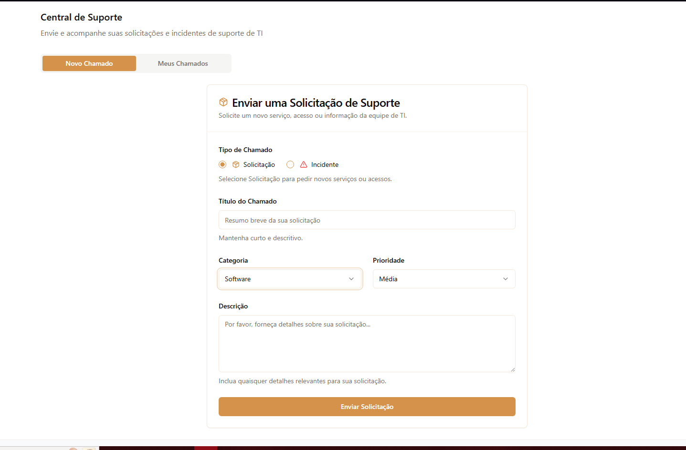
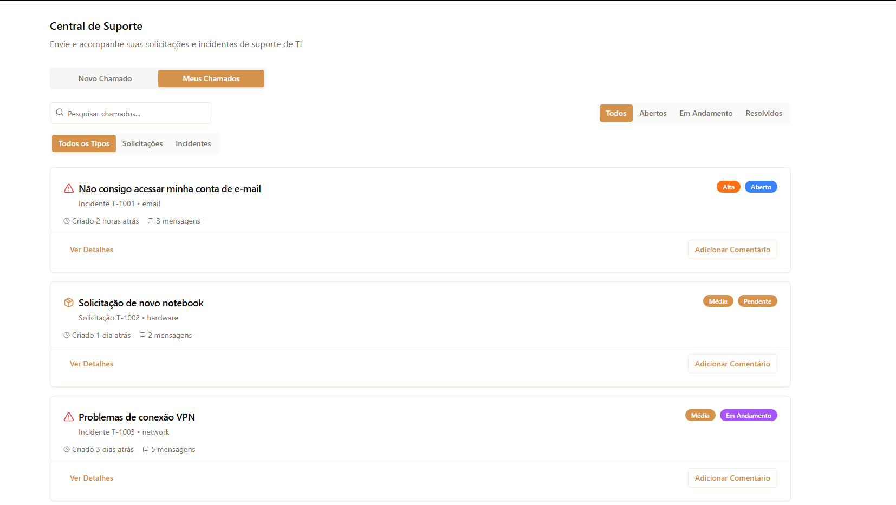

## 📸 Visualização

  <h3>🔐 Tela de Login</h3>
  

    <h3>📊 Painel Principal (Dashboard)</h3>

   

  <h3>✨ Funcionalidades do Sistema</h3>
  
  

    
    

      <h4>🆕 Abertura de Chamado</h4>
      
    

    
    

      <h4>📋 Meus Chamados e Detalhes</h4>
      
    

  

